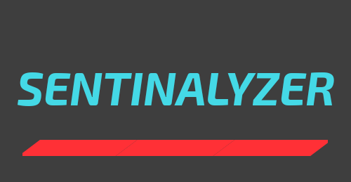

<h1 align="center">Sentinalyzer</h1></br>

<p align="center">
:smile: A web app which detects the sentiment of a movie review, whether it is positive or negative. :unamused:
</p>
<br>

<p align="center">
  <a href="https://github.com/k4u5h4L"></a>
</p>

<p align="center">
</img>
</p><br>

## Technologies used:

- React (create-react-app) for the front end.

- Python-Django for the backend server side.

- Tensorflow 2.3.0 with the Keras syntax for the model training and predictions.

## To run:

- Clone and cd into the repo.

```
git clone https://github.com/k4u5h4L/sarcasm-detector.git && cd sarcasm-detector
```

- Cd into the client and install the required dependencies

```
cd client && npm install
```

- In the `server/form/views.py` file, change the file path of the model and pickle file.

- Install the dependencies from the `requirements.txt` file

```
pip install -r requirements.txt
```

- Run the Django server.

```
python manage.py runserver
```

- In another terminal, run the front end React client.

```
npm start
```

- Now visit the location [localhost:3000](http://localhost:3000) to visit the site.

## Note:

- This project is made as a hobby and is <b>NOT</b> a commercial application.

- Any contribution is welcome. You can fork and submit a pull request.

- The dataset is got from [kaggle](https://kaggle.com) from [this page](https://www.kaggle.com/lakshmi25npathi/imdb-dataset-of-50k-movie-reviews) by [lakshmi25npathi](https://www.kaggle.com/lakshmi25npathi)
